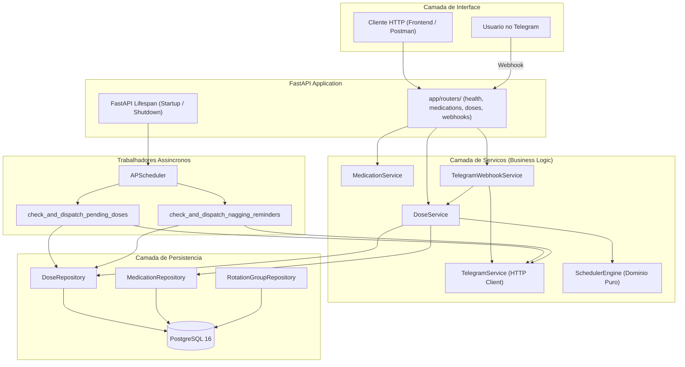

# Arquitetura do Sistema

O MedScheduler segue principios de arquitetura em camadas e desacoplamento conforme padroes de Clean Architecture e SOLID.

---

## Diagrama de Blocos

---

## Divisao de Responsabilidades

- **Routers (`app/routers/`)**: Recebem requisicoes HTTP, validam schemas Pydantic e injetam dependencias.
- **Services (`app/services/`)**: Centralizam regras de negocio, orquestracao de fluxos e chamadas a servicos externos.
- **Repositories (`app/repositories/`)**: Encapsulam exclusivamente operacoes de persistencia com SQLAlchemy 2.0 Async.
- **Engine (`SchedulerEngine`)**: Regras matematicas e de dominio puras sem dependencia de banco ou framework.
- **Workers (`app/workers/`)**: Rotinas de agendamento em background gerenciadas pelo APScheduler.
