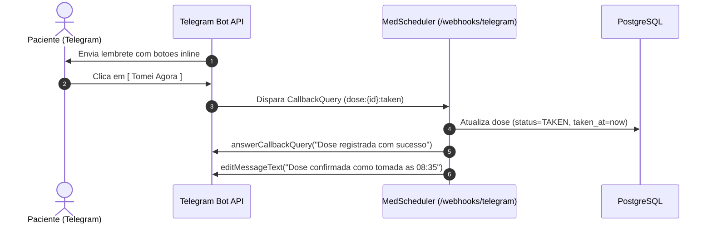

# Integracao com Telegram

O MedScheduler utiliza o Telegram Bot API como sua interface de usuario movel primaria.

---

## Estrutura da Notificacao de Dose

Quando uma dose atinge o horario programado, o trabalhador em background dispara uma mensagem com teclado inline:

```text
Hora do Remedio: Toragesic
Nota: Sublingual
[ Tomei Agora ] [ Adiar 15 min ]
[ Pular Dose ]
```

---

## Ciclo de Acoes Inline



A edicao da mensagem original substitui o teclado inline pelo texto de confirmacao, impedindo duplo clique acidental.

---

## Comandos Disponiveis

### `/status`
O paciente pode enviar a mensagem `/status` a qualquer momento para obter o panorama do dia:

- **Doses Tomadas**: Medicamentos e horarios reais de ingestao.
- **Proximas Doses Agendadas**: Horarios previstos para os proximos remedios.
- **Doses Adiadas / Puladas**: Historico de reprogramacoes.
